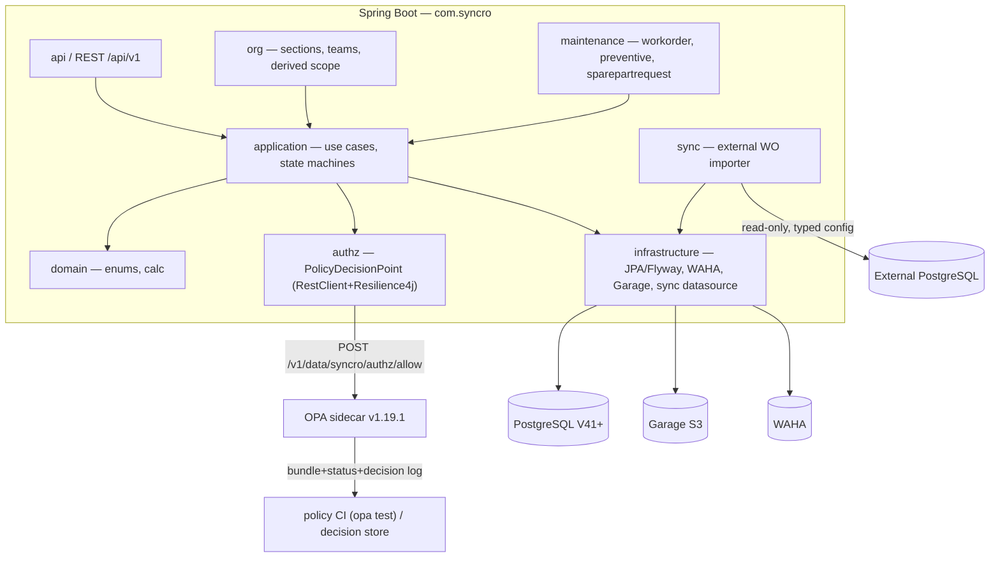

# Architecture Spine — Syncro Maintenance & OPA Authorization

## Design Paradigm

**Modular monolith + externalized authorization.** The backend stays a modular monolith: new bounded contexts under `com.syncro.{org,maintenance,authz,sync}` follow the Phase 1 layered shape (`api / application / domain / infrastructure`). Authorization is externalized to an **OPA sidecar** — the one decision the module cannot inline — while every other Phase 1 convention (REST `/api/v1`, Flyway+`ddl-auto=validate`, WAHA outbox, Garage storage, audit, UTC timestamps, trace IDs) is inherited unchanged.

```
Spring Boot (modular monolith)
  ├── api             REST controllers → application services (no business rules)
  ├── application     use cases, transactions, status transitions, OPA enforcement points
  ├── domain          enums, state machines, calculations
  └── infrastructure  JPA, Flyway, WAHA outbox, Garage, external-sync datasource
          │
          │ POST /v1/data/syncro/authz/allow   (input: subject/resource/action/context)
          ▼
        OPA sidecar ── bundles (Rego, opa test in CI) ── decision log + status API
```

## Inherited Invariants

| Inherited | From | Binds here |
| --- | --- | --- |
| Modular monolith; module-local repositories; cross-module access via application services / domain events | Phase 1 `architecture.md` | New `org`/`maintenance`/`authz`/`sync` modules may not reach into another module's repository |
| `ddl-auto=validate` + Flyway; next migration **V41**; additive migrations only | Phase 1 | All new tables are V41+; entity ↔ migration must match exactly |
| Standard error shape (`code`/`message`/`fieldErrors`/`timestamp`/`traceId`) | Phase 1 | All new endpoints use it; no exception/class names leaked |
| Timestamps UTC (ISO-8601); enums as uppercase strings; `traceId` on every request/job/event | Phase 1 | Workorder/preventive/sync/audit all follow |
| Plant scope: `SUPER_ADMIN` unrestricted; others masked to `auth_user_plant_assignments` | Phase 1 | Sections/workorders/sparepart-stock are plant-scoped |
| Job-scope ladder `TECHNICIAN < STAFF < LEADER < SPV < MANAGER` via `machine_responsibilities` | Phase 1 | Section leadership is derived from level `LEADER` per machine group |
| WAHA outbox pattern (`notification_jobs` + `notification_attempts`, rate limit, circuit breaker, escalation) | Phase 1 | WO/preventive/escalation notifications reuse it; `alert_id` constraint is extended, not dropped |
| Garage S3 object storage, PostgreSQL stores key only | Phase 1 | Evidence images & technical drawings follow the sparepart-image pattern |
| Immutable audit log; REST `/api/v1`; Orval-generated frontend clients; frontend never calls databases/OPA directly (NFR-013a) | Phase 1 | All new APIs under `/api/v1`; frontend uses `/authz/allowed-actions`, never OPA directly |

## Invariants & Rules

### AD-1 — Authorization is decided by OPA, enforced server-side

- **Binds:** all maintenance/org/sync resources (FR-160, FR-163, FR-164); `authz` context
- **Prevents:** authorization logic scattered across services; frontend visibility treated as enforcement; stale org data in OPA; divergent OPA input shapes between modules
- **Rule:** Every authorization-sensitive request is evaluated by OPA (default-deny) before business logic. OPA runs as a **sidecar HTTP** service (`POST /v1/data/syncro/authz/<rule>`); a coarse `allow` check at an interceptor plus row-level scoping in the query layer plus per-resource decisions in application services. Org data (roles, plants, sections, machine groups, active teams) is **derived from PostgreSQL and passed as input** — OPA is never the source of truth for org data. Each decision's `decision_id` is stored alongside the app audit record.
- **OPA input assembly** is a **single shared service** (`authz.PolicyDecisionPoint`); the interceptor, application services, and `/authz/allowed-actions` endpoint all use it. The input schema in Addendum A3 is authoritative. A failing OPA call (sidecar down) **defaults to deny** except a configurable degraded-mode allowlist (health/read endpoints).
- **Decision-log lifecycle:** decision logs enabled with input masking for sensitive fields (no WAHA secrets, no full phone numbers); retention 30 days configurable; bound to FR-162.

### AD-2 — Operational scope is derived from machine responsibilities, by one service

- **Binds:** FR-102, FR-103, FR-104; `org` module; OPA input derivation
- **Prevents:** dual manual setup of org role vs machine responsibility; drift between who-governs-what and responsibility data; modules computing divergent scope sets
- **Rule:** A user is a section leader for a machine group **iff** they hold `machine_responsibilities.level = LEADER` (or above) on that group. **Scope dimensions are exactly `{plantIds, machineGroupIds, activeTeamIds}`** — section is a container, not a scoping dimension (FR-103 forbids sibling-group visibility within a section). Scope derivation is a **single service in the `org` module**; the `maintenance` query layer must consume it, never recompute. The exact same scope set is passed to OPA input and applied to SQL row filtering. No separate "section leader" role assignment exists.

### AD-3 — Dual-source workorders with collision-free IDs

- **Binds:** FR-110, FR-111, FR-120; `maintenance.workorder`
- **Prevents:** ID collision between synced and internal workorders; duplicate numbering under concurrency; semantic duplicate creation; parent-child close races
- **Rule:** Workorder `id` is `sheet_no` from the external system when `source = SYNCED`, or auto-generated `WO-YYMMxxxx` when `source = INTERNAL`. `work_orders.id` is `VARCHAR(50)` UTF-8; `parent_id` is a self-FK (arbitrary varchar, cross-source chains allowed). Internal generation uses transaction + row lock (per-prefix sequence, 5-digit, monthly reset). The create-workorder endpoint accepts an optional `idempotencyKey` header — the service dedupes by it (5-minute window); the frontend sends a UUID on creation POSTs. Closing a parent requires `SELECT ... FOR UPDATE` on children statuses in the same transaction. `sync_version` guards conflict resolution.

### AD-4 — State machines are explicit, table-driven

- **Binds:** FR-114, FR-141; `maintenance.workorder`, `maintenance.sparepartrequest`
- **Prevents:** scattered transition conditionals; invalid transitions reaching persistence
- **Rule:** Workorder lifecycle `DRAFT → OPEN → ASSIGNED → IN_PROGRESS → ON_PROCUREMENT → IN_PROGRESS → DONE → CLOSED` (+ `CANCELLED` from OPEN/ASSIGNED) and sparepart-request flow `REQUESTED → ACKED → PROCESSING → [READY | PURCHASE_REQUESTED → PART_RECEIVED → READY] → PICKED_UP → CLOSED` are enforced by explicit transition logic. Invalid transitions return `INVALID_STATE_TRANSITION`. **Every transition writes a `_status_history` row + audit — including derived transitions (marked `source=DERIVED`, `actor=SYSTEM`).** `DONE → CLOSED` requires no non-terminal children (machine-readable blocking code); override is a SUPER_ADMIN/MANAGER action, audit-logged with reason.

### AD-5 — ON_PROCUREMENT is derived from sparepart-request state

- **Binds:** FR-114, FR-141, FR-181
- **Prevents:** manual status flapping; downtime mis-attribution while waiting for parts; ack-clock miscounting
- **Rule:** A workorder enters `ON_PROCUREMENT` when any live request on it is not `READY`, and resumes `IN_PROGRESS` when all requests are `READY`. The workorder state is recomputed from request state **on transition events (request READY/not-READY), not by a poller**. The recompute **must write a `_status_history` row with `source=DERIVED`**. Manual leader placement to ON_PROCUREMENT is allowed only when no live request exists; it is cleared by the same derivation. The 4-hour ack escalation worker computes elapsed time **from `_status_history` rows** (sum of IN_PROGRESS segments), never from live status.

### AD-6 — MTBF/MTTR are backend-computed from workorder data

- **Binds:** FR-115, FR-173, FR-123
- **Prevents:** frontend recalculation; the reference's `id`-ordering MTBF bug; stale analytics after sync mutations
- **Rule:** MTTR per workorder = cumulative sum of repair-session durations. MTBF = time between consecutive breakdown workorders **ordered by `woStopAt`** (not id). SLA response time = OPEN → first IN_PROGRESS session start. All computed backend-side; frontend renders values only. MTBF/MTTR are **recomputed from the current dataset**; a `last_analytics_at` watermark allows incremental computation, and sync mutations invalidate any analytics cache.

### AD-7 — Hardened external sync module

- **Binds:** FR-150..FR-154; `sync` context
- **Prevents:** the reference sync's failures (no transaction, no watermark, no lock, ordering bug, notification storms); sync bypassing module boundaries
- **Rule:** The sync job: processes in **batches inside a transaction**, ordered by `sheet_no ASC`, upsert-idempotent by external id, resumable from a **watermark**, guarded by a **distributed lock**, quarantines failed rows with reason+payload, records `sync_runs` audit, uses **typed config** for the external datasource, retries with backoff, converts `Asia/Jakarta` timestamps to UTC.
- **The sync module never writes `work_orders` via JPA directly.** Every row is passed to `maintenance.workorder.application.WorkorderImportService.upsert()` — the single upsert path that owns status history, audit, ON_PROCUREMENT evaluation, and notification enqueueing. The sync module does **not** notify independently.
- **Mapping step:** external machine code → Syncro `machine_id` and external plant code → Syncro `plant_id` resolve through a **configurable mapping table**; unmapped machines/plants quarantine the row with a clear reason (no stub machines, no silent skip).

### AD-8 — Sync conflicts: external master wins, local operational wins

- **Binds:** FR-111, FR-152
- **Prevents:** sync overwriting local evidence/reports/ratings; terminal states reopened by sync; field classification ambiguity
- **Rule:** For `source = SYNCED` workorders, external master fields take external values; local operational fields (report, evidence, ratings) are preserved. The **field classification is configuration** — a `sync_field_mappings` table (`field_name`, `domain=MASTER|OPERATIONAL`); unmapped fields default to MASTER. Resolution is deterministic and audit-logged per run.
- **Terminal-state protection:** sync must not transition a `DONE`/`CLOSED` workorder out of that state; a regressed external status quarantines the row with `TERMINAL_STATE_PROTECTED`. External status also does **not** override a locally-derived `ON_PROCUREMENT`. Sync upsert of a child checks the parent's status and rejects (quarantine) if the parent is `CLOSED`. External category is mapped per a configurable mapping (resolve OQ-4); unmapped categories use a configurable fallback.

### AD-9 — Notifications use a polymorphic outbox target

- **Binds:** FR-147, FR-180, FR-181; `notification` integration
- **Prevents:** forking the WAHA pipeline per entity type; breaking existing `notification_jobs`; double sends on polymorphic targets
- **Rule:** `notification_jobs` gains nullable `target_type`/`target_id`; `alert_id` becomes **nullable** (additive migration; existing alert rows keep their non-null `alert_id`; `uq_notification_jobs_alert_level` and idempotency semantics preserved). **Idempotency key for polymorphic targets = `target_type + target_id + template_name + recipient_id`.** The maintenance module enqueues notifications via the `notification` module's application service — never by writing `notification_jobs` directly. Same outbox, worker, rate-limit, circuit-breaker, and escalation machinery.

### AD-10 — Evidence and technical drawings live in Garage

- **Binds:** FR-116, FR-175
- **Prevents:** image bytes in PostgreSQL; orphaned objects
- **Rule:** Before/after evidence and technical drawings (JPEG/PNG/WebP/PDF, ≤10 MB, configurable) are stored in Garage via the existing `ObjectStorageService`; PostgreSQL stores only object keys. Replacing/deleting removes the previous object.

### AD-11 — Stock OP/OQ is keyed by material code; mutation has one owner

- **Binds:** FR-146, FR-144, FR-141
- **Prevents:** per-machine BOM/taxonomy stock fragmentation; breaking the one-code-one-sparepart identity; lost stock updates; negative stock; cross-module writes to `spareparts`
- **Rule:** `sparepart_stock(material_code, plant_id, stock_on_hand, order_point, order_qty)` unique per `(material_code, plant_id)`. Reorder warning (`stock_on_hand ≤ order_point → recommend purchase qty = order_qty`) is a **business-rule signal** computed in the application layer; the resulting purchase-request action is authorized by OPA. Material code reuses Phase 1 `spareparts.material_code` (FR-078).
- **Stock mutation is owned by the inventory module.** `PICKED_UP` decrements via an inventory application-service call (gated by OPA, AD-1), not by the maintenance module writing stock directly. All `stock_on_hand` mutations use `version` optimistic lock and an **atomic conditional update** (`stock_on_hand - qty` guarded by `stock_on_hand >= qty`); negative stock is rejected server-side. New-item completion (FR-144) creates/updates the `spareparts` record **via the `masterdata` module's application service** — the maintenance module never writes `spareparts` directly.

### AD-12 — Preventive and workorders work without telemetry

- **Binds:** FR-130..FR-134, FR-170
- **Prevents:** IoT dependency blocking maintenance execution
- **Rule:** Workorder and preventive modules must function for machines without MQTT. MTTR uses repair-session timestamps; preventive scheduling is calendar/shift-based (MONTHLY/ANNUAL, floating interval from completion) using shift config (V40). Sparepart lifetime counters are used only when telemetry exists; otherwise state is "insufficient data", never a fabricated value.

### AD-13 — Cross-plant teams are scoped and expiry-dated

- **Binds:** FR-105, FR-163
- **Prevents:** permanent cross-plant access leaks; OPA-input vs SQL-filter scope divergence for teams
- **Rule:** Cross-plant teams have an expiry date; OPA input includes only active (non-expired) team memberships. Expired membership automatically revokes extra scope without a policy redeploy. **Cross-plant team machine IDs are merged into the `machineGroupIds` scope for SQL filtering** (AD-2); the scope passed to OPA and applied to SQL is identical (single `org` scope service).

### AD-14 — The section leader does not execute their own workorders

- **Binds:** FR-113, FR-121, FR-124
- **Prevents:** delegation bypass; self-rating conflict of interest
- **Rule:** A section leader cannot be the executing technician on a workorder in their own group; they delegate to technicians. Technician rating is given by the workorder's section leader; maintenance-workorder rating by the PRODUCTION_LEADER (FR-124). Both are immutable after submission. **Rating dimensions are data (not code), configured by SUPER_ADMIN** (default set pending OQ-1); configuration authorization via AD-1.

### AD-15 — Role taxonomy migration from Phase 1 application roles

- **Binds:** FR-002, FR-003; all role-sensitive endpoints; `auth` + `org` + `authz`
- **Prevents:** divergent role modeling (new roles table vs extended enum), MANAGE/VIEWER mapping drift, inconsistent OPA `subject.roles`
- **Rule:** The PRD's ten roles are introduced via **additive migration (V41+)** that extends `auth_users.application_role` (new CHECK constraint) — Phase 1 `SUPER_ADMIN` stays; `MANAGE` maps to `MANAGER_MAINTENANCE`; `VIEWER` maps to a read-only role. `application_role` remains the coarse application role; **operational scope is derived separately** (AD-2). OPA `subject.roles` = the application role (extended enum) **plus** the derived scope (plantIds/machineGroupIds/activeTeamIds). PRODUCTION_LEADER scope is line/plant-derived from `auth_user_plant_assignments` (or a new production-line binding); SUPER_ADMIN bypasses all checks (Phase 1 pattern).

### AD-16 — Approval separation-of-duty is enforced before OPA

- **Binds:** FR-142; `maintenance.sparepartrequest`
- **Prevents:** a requester approving their own request; inconsistent threshold tiering
- **Rule:** A requester can **never** approve their own request (server-side, enforced before OPA/state machine). Threshold tiering by estimated cost (`qty × est. price`) is a business-rule signal computed in the application layer; tiers configurable via `escalation_configs` (v1 defaults section-leader ≤ 5M IDR, maintenance-leader 5M–50M, manager >50M). When est. price is absent, the request requires section-leader approval regardless of quantity.



## Consistency Conventions

| Concern | Convention |
| --- | --- |
| Module naming | `com.syncro.<context>` (`org`, `maintenance`, `authz`, `sync`); layers `api/application/domain/infrastructure` |
| DB naming | snake_case plural tables; FKs named `&lt;referenced-table-singular&gt;_id`; `idx_<table>_<cols>`; `uq_<table>_<cols>`; enums uppercase strings; UUID PKs; `version` optimistic lock; TIMESTAMPTZ defaults `NOW()` |
| API | `/api/v1`; plural resources; camelCase query/body; records for DTOs (`Request`/`Response`/`View`); stable error shape; `allowedActions` in operational responses |
| Timestamps | UTC ISO-8601 everywhere; external `Asia/Jakarta` converted at sync boundary; display conversion at UI only |
| Status enums | Workorder & sparepart-request enums (AD-4) owned in domain; frontend renders values only |
| State mutation | Application services own transitions/transactions; every mutation audit-logged with actor, action, target, result, traceId |
| Authorization | OPA server-side (AD-1); frontend via `/authz/allowed-actions`; row-scoping in queries; hiding is UX only |
| Money & counts | BigDecimal for money/quantities; counter deltas backend-owned; no float |
| Config | Typed `*Properties` classes + env; no hardcoded external URLs/creds/topics |
| Notifications | Outbox pattern (AD-9); idempotency key; never inline with request/ingest path; secrets never logged |

## Stack

| Name | Version | Note |
| --- | --- | --- |
| Java / Spring Boot | Java 25 / Spring Boot 4.0.6 → bump to 4.0.8 on next manifest touch | inherited, authoritative; 4.0.8 is current 4.0.x patch |
| Next.js | 16.2.6 → bump to ≥16.2.11 (plan 16.3) | inherited; 16.2.6 below security-patched line |
| TanStack Table | v9 (latest) | tabular main views (addendum A1) |
| OPA | 1.19.1 | sidecar; verified 2026-08-17 (GitHub releases) |
| PostgreSQL / Flyway | inherited | next migration V41 |
| Garage (S3-compatible) | inherited | evidence storage (garagehq.deuxfleurs.fr) |
| WAHA | inherited | WhatsApp outbox |

## Structural Seed

```text
syncro/apps/backend/src/main/java/com/syncro/
  org/                    # sections, machine-group→section, cross-plant teams, derived scope
    api/ application/ domain/ infrastructure/
  maintenance/
    workorder/            # WO, categories, sessions, status history, attachments, reports, todos, ratings
    preventive/           # programs, schedules, checklist, results, reports
    sparepartrequest/     # requests, events, stock OP/OQ
  authz/                  # PolicyDecisionPoint, allowed-actions endpoint, OPA client
  sync/                   # external WO importer, sync_runs, sync_quarantine, sync_watermarks
  notification/           # (extended) polymorphic outbox target

syncro/apps/web/src/
  features/org/  features/workorders/  features/preventive/
  features/sparepart-requests/  features/dashboards/
  components/syncro/workorder-table.tsx  # TanStack Table v9

db/migration/
  V41..Vxx_add_workorders.sql
  V41..Vxx_add_sections_teams.sql
  V41..Vxx_add_sparepart_stock.sql
  V41..Vxx_add_sync_tables.sql
  V41..Vxx_alter_notification_jobs_polymorphic.sql
```

## Capability → Architecture Map

| Capability / Area | Lives in | Governed by |
| --- | --- | --- |
| Org structure & sections (FR-100..FR-105) | `org` | AD-2, AD-13 |
| Workorder lifecycle, dual source, sessions, parent-child (FR-110..FR-124) | `maintenance.workorder` | AD-3, AD-4, AD-5, AD-6, AD-14 |
| Preventive programs & schedules (FR-130..FR-134) | `maintenance.preventive` | AD-12 |
| Sparepart request & stock OP/OQ (FR-140..FR-147) | `maintenance.sparepartrequest` | AD-4, AD-11 |
| External WO sync (FR-150..FR-154) | `sync` | AD-7, AD-8 |
| OPA enforcement & allowed-actions (FR-160..FR-164) | `authz` | AD-1, AD-13 |
| Dashboards & reports (FR-170..FR-175) | `maintenance.*` + frontend | AD-6, AD-10, AD-12 |
| WAHA notifications (FR-180..FR-181) | `notification` (extended) | AD-9 |

**Module-owned rules** (application-layer, below architecture altitude — acknowledged so they are not forgotten): FR-112 (WO categories), FR-117 (CP/CPK optional), FR-119 (todos/kanban), FR-122 (stop-time reason), FR-143 (purchase URL), FR-145 (MRE manual), FR-174 (rating-dimension config). These live in `maintenance.workorder` / `maintenance.sparepartrequest` per the conventions.

## Operational & Environmental Envelope

- **Deployment & environments:** OPA runs as a sidecar container in the existing `infra/docker-compose.yml` (stable name `opa`) alongside `postgres`/`redis`/`influxdb`/`emqx`/`waha`/`garage`. The sync job is a Spring `@Scheduled` worker inside the backend (Phase 1 worker pattern); it reaches the external PostgreSQL from the same network. Deployment target remains **deferred, container-friendly** (inherited Phase 1 stance).
- **Infra/provider strategy:** no new provider; the extension adds only the OPA service + the external-read datasource, both typed-config.
- **Operations:**
  - OPA bundles: built via `opa build` in CI (`opa test` gate), versioned; activated via the bundle API; bundle activation/health visible through the OPA status API.
  - Decision logs: enabled with input masking (AD-1); retention 30 days configurable.
  - Sync observability: `sync_runs` + `sync_quarantine` surfaced on the health dashboard; restart resumes from watermark (AD-7).
  - Sidecar-down behavior: default-deny with configurable degraded-mode allowlist (AD-1).

## Open Questions

Escalated from PRD §8 (OQ-1..OQ-7); none blocks story creation but each must be resolved before the relevant implementation lands:
- **OQ-1** Rating-dimension default set + who configures (AD-14 default: SUPER_ADMIN).
- **OQ-2** Default escalation duration per `escalation_configs` step.
- **OQ-3** Stop-time reason codes: fixed enum vs configurable taxonomy.
- **OQ-4** External priority → local category mapping (affects AD-6 MTBF and AD-8 category mapping) — resolve before sync implementation.
- **OQ-5** Signature mechanism: image upload vs typed+confirmation.
- **OQ-6** 4-hour ack threshold: per-workorder vs global.
- **OQ-7** UMR source/cadence for deferred labor-cost projection.

## Deferred

- **Embedded OPA (WASM/IR)** — sidecar chosen (AD-1); revisit if policy latency becomes a measured problem or infra cannot host a sidecar.
- **Full FMEA module (RPN worksheets)** — v1 only tags workorders with an FMEA failure type.
- **MTTR labor-cost projection via UMR** — session hours recorded in v1; cost conversion deferred; shift operating-days-per-month is available in settings.
- **Production/OEE dashboards** — production leaders request/ack/rate only in this module.
- **Live procurement integration** — external system has no API; MRE code is manual reference.
- **Server-side PDF generation** — v1 uses browser print of WYSIWYG HTML; signature is image + signer identity.
- **Auto-login WA link hardening (PIN/OTP)** — v1 trusts phone-number binding; revisit before multi-plant rollout.
- **Approval threshold values** — configurable (AD-16); v1 defaults (section-leader ≤5M, leader 5M–50M, manager >50M IDR) pending confirmation.
- **Sync category mapping** — OQ-4 must be resolved before sync implementation binds the mapping.
