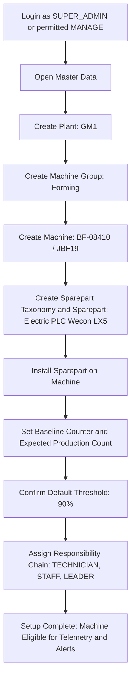
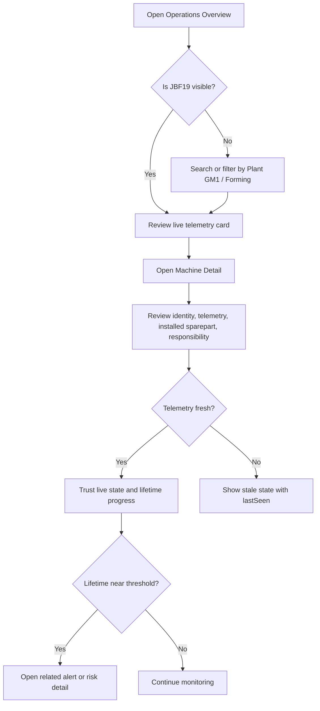
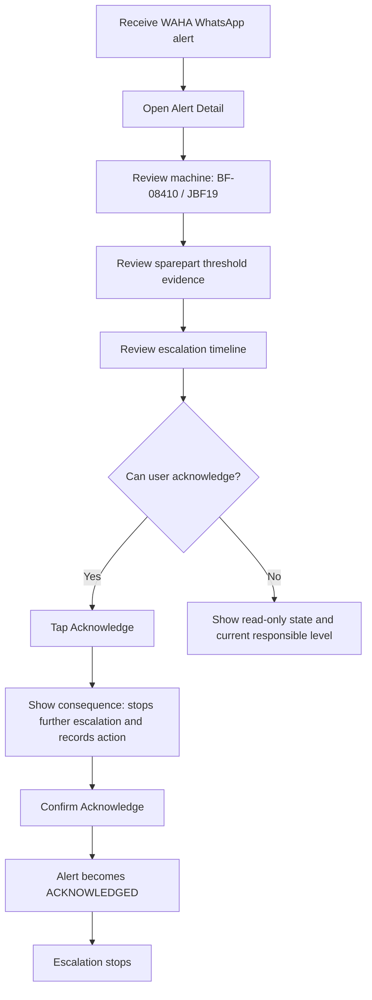
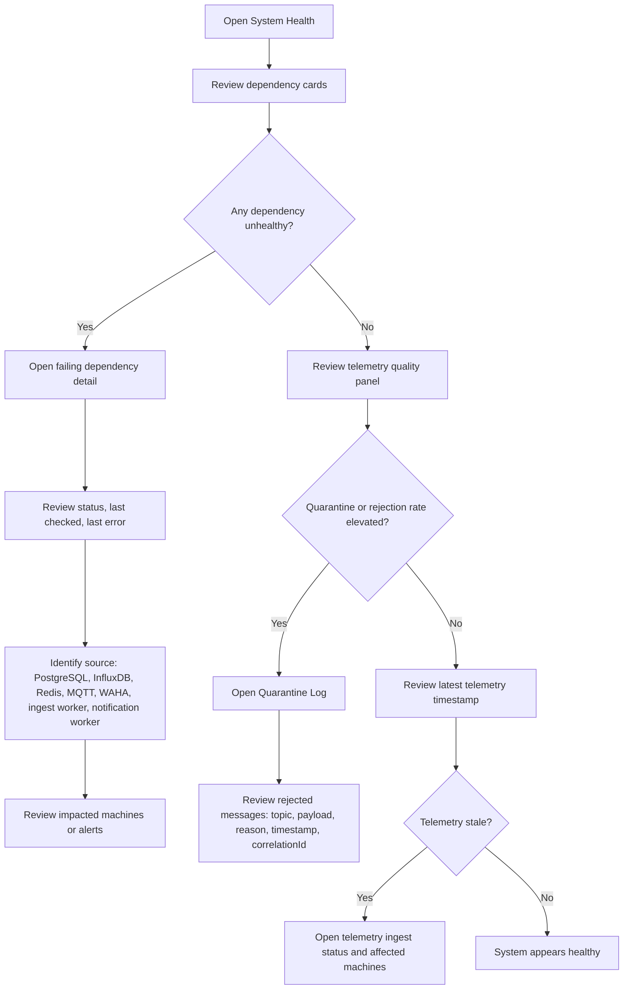
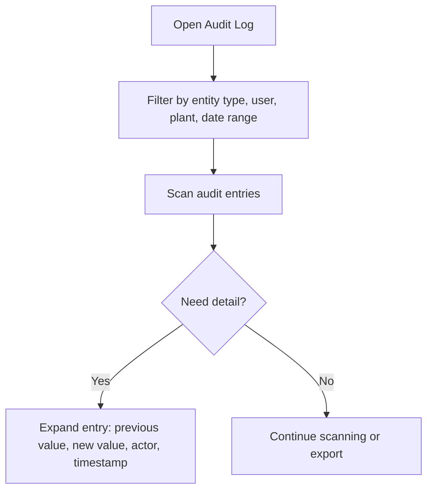

# UX Design Specification Syncro

**Author:** Yusuf
**Date:** 2026-05-22

**Implementation references:**
- `frontend-hardening-specification.md` — boilerplate audit, semantic tokens, component TypeScript interfaces, strip/keep/adapt decisions, build sequence, zero new dependencies confirmation.
- `page-specifications.md` — detailed layout, content sections, states, microcopy, responsive behavior, data refresh, and cross-screen patterns for Operations Overview, Machine Detail, Alert Detail, and System Health.

---

<!-- UX design content will be appended sequentially through collaborative workflow steps -->

## Executive Summary

### Project Vision

Syncro Phase 1 is an internal industrial maintenance foundation that connects machine master data, validated MQTT telemetry, sparepart production-count thresholds, staged WAHA WhatsApp escalation, and system health visibility. The UX should make the end-to-end operational loop clear: configure machines, receive telemetry, detect sparepart risk, notify the responsible people, and diagnose platform failures.

### Target Users

- **SUPER_ADMIN:** configures the platform, manages users and roles, maintains master data, and monitors system health.
- **MANAGE:** creates, edits, and views operational records within job-scope constraints.
- **VIEWER:** reviews dashboards, telemetry, alerts, and histories without changing operational records.
- **Job-scope users:** `TECHNICIAN`, `STAFF`, `LEADER`, `SPV`, and `MANAGER` participate in responsibility and escalation flows.

Users may access Syncro from desktop, tablet, and mobile devices. Desktop supports full setup and administration. Tablet supports shop-floor review and dashboard use. Mobile supports alert review, acknowledgement, and quick status checks.

### Key Design Challenges

- Present chained setup flows without overwhelming users: plant, machine group, machine, sparepart taxonomy, installed sparepart, and responsibility.
- Clearly distinguish machine status, telemetry connectivity, alert status, and WAHA notification status.
- Support responsive layouts across desktop, tablet, and mobile without losing operational clarity.
- Make future ABAC/job-scope constraints feel consistent without overcomplicating Phase 1.
- Help SUPER_ADMIN quickly diagnose failures across PostgreSQL, InfluxDB, Redis, MQTT, WAHA, ingest worker, and notification worker.

### Design Opportunities

- Use a guided setup sequence for machine foundation configuration.
- Make machine detail the central operational page for telemetry, installed spareparts, responsibility, alerts, and status.
- Use escalation timelines on alert detail pages so users understand who was notified and what happened next.
- Use simple health cards and dependency status indicators to make infrastructure failures visible.
- Prioritize mobile-friendly alert acknowledgement and quick status review for on-floor users.

## Core User Experience

### Defining Experience

Syncro Phase 1 centers on a multi-role industrial operations loop: configure machine foundation data, receive validated telemetry, detect sparepart threshold risk, notify responsible users, acknowledge or resolve alerts, and monitor system health. No single user action owns the product alone; the experience succeeds when setup, monitoring, alert response, and health diagnosis connect into one understandable workflow.

The first proof of experience is that live telemetry for machine `BF-08410` / `JBF19` appears clearly and reliably. This confirms the platform can connect machine identity, MQTT ingest, telemetry storage, and latest-state display. The business proof is that the same machine can reach the configured sparepart threshold, create an alert, send WAHA escalation, and stop escalation after acknowledgement.

### Platform Strategy

Syncro is an online-only responsive web application.

- **Desktop:** full administration, setup, table-heavy management, health diagnosis, and template configuration.
- **Tablet:** shop-floor monitoring, machine detail review, telemetry inspection, and alert triage.
- **Mobile:** alert reading, acknowledgement, quick machine summary, escalation review, and urgent status checks.

The product does not support offline use in Phase 1 because telemetry, WAHA escalation, and system health depend on live backend connectivity.

### Primary Screens and Questions

- **Operations Overview:** What needs attention now?
- **Machine Detail:** What is happening with this machine?
- **Telemetry Dashboard:** Is live telemetry flowing and readable?
- **Alert Detail:** Who needs to act, what happened, and what happens next?
- **System Health:** Which dependency or worker is failing?
- **WAHA Template Editor:** What text will be sent when an alert fires?

### Effortless Interactions

The following interactions should require minimal thought:

- Finding the current state of a machine from its detail page.
- Seeing whether `JBF19` is receiving live telemetry.
- Understanding whether a sparepart is approaching its 90% threshold.
- Acknowledging an alert from mobile.
- Seeing who has been notified in the escalation chain.
- Distinguishing machine status, telemetry status, alert status, and WAHA delivery status.
- Diagnosing whether a telemetry or notification failure comes from PostgreSQL, InfluxDB, Redis, MQTT, WAHA, ingest worker, or notification worker.
- Creating and editing WAHA text templates without knowing technical message formatting.

### Critical Success Moments

- Live telemetry for `BF-08410` / `JBF19` appears on the Operations Overview, Telemetry Dashboard, and Machine Detail page.
- The JBF19 telemetry card shows `running`, `counting`, `runtimeHours`, and `lastSeen`.
- An installed sparepart reaches 90% consumed production count and creates an `OPEN` alert.
- WAHA sends the alert message to the configured responsibility chain.
- A responsible user can acknowledge the alert from mobile and stop further escalation.
- SUPER_ADMIN can identify platform dependency failures from the System Health page.

### Experience Principles

- **Machine-first clarity:** Machine Detail is the central place for identity, telemetry, spareparts, responsibility, and alerts.
- **Action-first overview:** Operations Overview prioritizes risks, alerts, live telemetry, and health signals over decorative charts.
- **Responsive by task:** desktop supports configuration, tablet supports inspection, mobile supports response.
- **Status separation:** machine active state, telemetry freshness, alert lifecycle, and WAHA delivery must never be visually conflated.
- **Trust through timestamps:** every important status and operational event shows its timestamp, including last telemetry received, alert created, notification sent or failed, acknowledgement, resolution, and last health check.
- **Guided complexity:** chained setup flows guide users through dependencies instead of exposing raw data model complexity.
- **Audit-friendly by default:** alert and notification history should preserve actor, timestamp, target, action, and result.

## Desired Emotional Response

### Primary Emotional Goals

Syncro should make users feel calm, informed, and in control. Alerts should feel actionable rather than alarming. System health should create confidence that failures can be traced to a clear source.

For mobile alert response, TECHNICIAN and STAFF users should feel calm because the screen explains what happened, which machine is affected, what sparepart crossed threshold, who has been notified, and what action is expected.

For SUPER_ADMIN health monitoring, the desired feeling is diagnostic confidence: the user should feel they can identify whether the issue comes from PostgreSQL, InfluxDB, Redis, MQTT, WAHA, ingest worker, notification worker, or stale telemetry.

### Emotional Journey Mapping

- **First use:** users should feel oriented by clear navigation, recognizable industrial terms, and guided setup paths.
- **Live telemetry success:** users should feel trust when `JBF19` telemetry appears with current values and timestamps.
- **Alert received:** users should feel calm urgency because the alert explains severity, threshold, machine, sparepart, and next action.
- **Acknowledgement:** users should feel safe clicking acknowledge because the consequence is clearly stated: escalation stops and the action is recorded.
- **Resolution:** users should feel confident that resolving an alert records an operational decision, not deletes evidence.
- **Failure diagnosis:** SUPER_ADMIN should feel certain about the failing dependency or worker.
- **Returning use:** users should feel the system is reliable because status, history, and timestamps remain consistent.

### Micro-Emotions

- **Trust over skepticism:** data must show timestamps, source, calculation, and latest state.
- **Confidence over fear:** state-changing actions need clear labels, consequence text, and confirmation when appropriate.
- **Calm urgency over panic:** alert styling should communicate priority without overwhelming red-heavy screens.
- **Clarity over confusion:** machine status, telemetry freshness, alert lifecycle, and WAHA delivery must remain visually distinct.
- **Accountability over ambiguity:** acknowledgement, resolution, escalation, and notification attempts should show actor, time, and result.

### Design Implications

- Use existing theme presets from the selected Next.js shadcn admin dashboard boilerplate rather than inventing a custom visual system in Phase 1.
- Use consistent status badges and icons for machine, telemetry, alert, WAHA, and health states.
- Show timestamps near every operational status.
- Show clear action consequences on acknowledge and resolve controls.
- Use confirmation for resolve actions and SUPER_ADMIN override.
- Keep alert copy direct: what happened, where, why it matters, and what to do next.
- Avoid decorative charts that reduce trust or distract from operational action.
- Provide empty, loading, error, and stale-data states that explain what is happening.
- Explain sparepart lifetime calculation using baseline counter, current count, consumed count, expected count, and threshold percentage.
- Health failure cards should show dependency, status, last checked time, and last error.

### Microcopy Guidelines

- Acknowledge alert: “Stops further escalation and records your action.”
- Resolve alert: “Marks maintenance follow-up complete. History remains available.”
- Stale telemetry: “Telemetry stale — last data received {duration} ago.”
- WAHA unavailable: “Messages are queued but not sending.”
- Threshold reached: “Sparepart reached {threshold}% of expected production count.”

### Emotional UX Acceptance Criteria

- The acknowledge action includes consequence text before the user clicks.
- Resolve and SUPER_ADMIN override actions require confirmation.
- Every status component includes a timestamp or last-updated indicator.
- Stale telemetry has a distinct visual state and explanatory message.
- Health failure cards show dependency name, current status, last checked timestamp, and last error.
- Sparepart lifetime widgets show baseline count, current count, consumed count, expected count, and threshold percentage.

### Emotional Design Principles

- **Calm by default:** screens should reduce uncertainty, not amplify alarm.
- **Trust through evidence:** show data source, timestamp, calculation, actor, and result wherever operational decisions happen.
- **Safe action:** users should understand the consequence before acknowledging or resolving an alert.
- **Actionable urgency:** alerts should lead users to the next action quickly without creating panic.
- **Theme-consistent execution:** use boilerplate theme presets and shadcn/ui consistency as the visual foundation.

## UX Pattern Analysis & Inspiration

### Inspiring Products Analysis

#### arhamkhnz / next-shadcn-admin-dashboard

This admin dashboard template is the primary UX inspiration for Syncro Phase 1. It provides a modern Next.js, Tailwind CSS, and shadcn/ui foundation with collapsible sidebar navigation, responsive layout, theme presets, authentication screens, dashboard cards, tables, forms, and route-based module organization.

For Syncro, the most relevant inspiration is not the sample business domains, but the admin shell pattern: consistent navigation, reusable cards, clean tables, validated forms, light/dark theme support, and responsive behavior for desktop, tablet, and mobile.

### Transferable UX Patterns

- **Collapsible sidebar navigation:** adapt for Operations Overview, Master Data, Telemetry, Alerts, WAHA Templates, System Health, and Settings.
- **Card-based dashboard layout:** adapt for live telemetry, open alerts, sparepart threshold risk, and dependency health.
- **Table-first management screens:** adapt for plants, machine groups, machines, spareparts, installed spareparts, responsibilities, and alert history.
- **Validated form patterns:** use for master data creation, machine sparepart installation, responsibility assignment, and WAHA text template editing.
- **Theme presets:** use existing boilerplate theme presets rather than creating a custom visual system in Phase 1.
- **Responsive admin shell:** desktop uses full sidebar and tables; tablet uses collapsible navigation and cards; mobile prioritizes alert response and summary views.

### Syncro-Specific Adaptations

- Use Syncro information architecture rather than boilerplate demo domains: Operations Overview, Master Data, Telemetry, Alerts, WAHA Templates, System Health, and Settings.
- Use industrial terminology: Machine Group / Process Line, Installed Sparepart, Responsibility Chain, Telemetry Freshness, WAHA Delivery, and System Health.
- Add a semantic status system on top of the boilerplate theme presets:
  - Green: healthy, live, successful.
  - Yellow: warning, stale, approaching threshold.
  - Red: failure, critical, threshold reached.
  - Blue or neutral: informational, configured, pending.
  - Gray: inactive, unknown, disabled.
- Status must never rely on color alone; every status badge needs a text label and accessible contrast.

### Anti-Patterns to Avoid

- **Generic dashboard charts without operational action:** avoid decorative cards that do not help users respond to telemetry, alerts, or health failures.
- **Mini desktop on mobile:** do not force full data tables and setup forms into mobile as the primary experience.
- **Status overload:** avoid using the same color or badge style for machine status, telemetry freshness, alert lifecycle, WAHA delivery, and health status without clear labels.
- **Hidden consequences for actions:** avoid acknowledge or resolve buttons that do not explain what will happen.
- **Theme-first design:** do not let visual presets override industrial readability, accessible contrast, and evidence clarity.
- **Color-only status:** do not communicate critical state by color without label, icon, timestamp, or supporting text.

### Design Inspiration Strategy

Syncro should adopt the boilerplate’s shell, theme presets, responsive foundation, forms, tables, cards, and component consistency. Syncro should adapt those patterns into an industrial command surface where machine status, telemetry freshness, sparepart threshold risk, alert escalation, WAHA delivery, and system health are visually distinct and action-oriented.

The design should stay close to the boilerplate for implementation speed, but make Machine Detail, Alert Detail, Operations Overview, and System Health feel purpose-built for industrial maintenance operations rather than generic SaaS analytics.

## Design System Foundation

### 1.1 Design System Choice

Syncro Phase 1 will use a themeable shadcn/ui design system foundation through the selected Next.js admin dashboard boilerplate. The product will not create a custom design system in Phase 1. It will adopt the boilerplate’s layout shell, theme presets, cards, tables, forms, dialogs, navigation, responsive behavior, and component conventions.

### Rationale for Selection

- **Speed:** Phase 1 is an internal build and benefits more from fast, consistent implementation than visual uniqueness.
- **Fit:** The boilerplate already provides admin-dashboard patterns needed for master data, telemetry, alerts, system health, and template management.
- **Consistency:** shadcn/ui and Tailwind support reusable UI primitives while preserving customization through tokens and class variants.
- **Responsiveness:** the dashboard foundation supports desktop, tablet, and mobile adaptation.
- **Maintainability:** using boilerplate conventions reduces custom UI debt and keeps future implementation predictable.

### Implementation Approach

Syncro will use a two-layer design system approach.

#### Base System

- shadcn/ui components.
- Tailwind CSS styling and tokens.
- Admin dashboard boilerplate shell.
- Existing theme presets.
- Boilerplate navigation, table, form, dialog, and responsive layout conventions.

#### Syncro Domain Layer

- Industrial status semantics.
- Syncro-specific terminology.
- Operational components for telemetry, lifetime, health, escalation, and audit evidence.
- Timestamp and evidence display patterns.
- Responsive task rules for desktop, tablet, and mobile.

Syncro-specific modules will be built inside the shell:

- Operations Overview.
- Master Data.
- Telemetry.
- Alerts.
- WAHA Templates.
- System Health.
- Settings.

### Domain Component Strategy

Create Syncro-specific wrappers only where domain meaning exists:

- `StatusBadge` for machine, telemetry, alert, WAHA, and health states.
- `HealthCard` for dependency and worker status.
- `TelemetryCard` for latest machine telemetry.
- `LifetimeProgress` for sparepart production-count consumption.
- `EscalationTimeline` for staged WAHA notification flow.
- `AuditEventRow` for actor, timestamp, action, and result history.

Base shadcn/ui components should remain close to boilerplate defaults unless domain clarity requires a wrapper.

### Customization Strategy

Add Syncro semantic status tokens and variants on top of the boilerplate theme:

- **Healthy / Live / Success:** stable, clear, not celebratory.
- **Warning / Stale / Approaching Threshold:** cautious, visible, not broken.
- **Critical / Failed / Threshold Reached:** urgent, focused, not chaotic.
- **Informational / Configured / Pending:** neutral and explanatory.
- **Inactive / Unknown / Disabled:** intentional or unknown, not confused with failure.

Status states must use label + color + icon or timestamp where useful; never color alone.

### Implementation Constraints

- Do not use one-off inline status styling.
- Do not communicate status by color alone.
- Do not create custom table implementations when the boilerplate table pattern is sufficient.
- Forms should use the shared validation pattern from the boilerplate stack.
- Route modules should follow the boilerplate folder and layout conventions where possible.
- Domain cards must support loading, empty, error, and stale states.
- Alert detail on mobile must keep the primary action visible without requiring deep scrolling.

### Responsive Layout Strategy

- **Desktop:** sidebar navigation, dense tables, split/detail layouts, bulk configuration workflows.
- **Tablet:** collapsible navigation, cards, tabs, shop-floor inspection layouts.
- **Mobile:** stacked cards, compact summaries, sticky primary action, alert acknowledgement and quick machine status.

## 2. Core User Experience

### 2.1 Defining Experience

The defining experience for Syncro Phase 1 is: Syncro tells the user which machine needs maintenance attention and what to do next.

For the Phase 1 pilot, this means a user can open the system, see live telemetry for `BF-08410` / `JBF19`, understand whether its installed sparepart is approaching the 90% threshold, and act on the resulting alert with confidence.

This is the interaction that proves Syncro works: machine identity, MQTT telemetry, latest state, sparepart lifetime calculation, alert creation, WAHA escalation, acknowledgement, and audit history all connect into one visible operational flow.

### 2.2 User Mental Model

Users think in operational terms: plant, line, machine, sparepart, responsibility, and action. They do not think in database tables or infrastructure layers. The UX should match that mental model by making Machine Detail the central operational context and using industrial language consistently.

Current manual approaches likely rely on checking machine output, remembering sparepart age or count, contacting responsible people manually, and troubleshooting failures by asking multiple people. Syncro replaces that scattered workflow with visible telemetry, calculated thresholds, escalation evidence, and health diagnosis.

### 2.3 Success Criteria

The core experience succeeds when:

- `JBF19` appears as an active machine with live telemetry.
- Users can see `running`, `counting`, `runtimeHours`, and `lastSeen`.
- Sparepart lifetime progress is explainable from baseline, current count, consumed count, expected count, and threshold.
- A 90% threshold crossing creates an `OPEN` alert.
- WAHA escalation history shows who was notified and when.
- A responsible user can acknowledge from mobile and understand that escalation stops.
- SUPER_ADMIN can verify system health if telemetry or WAHA behavior fails.

### 2.4 Novel UX Patterns

Syncro mostly uses established patterns: admin navigation, tables, forms, cards, timelines, status badges, progress indicators, and detail pages. The unique combination is industrial: telemetry freshness, sparepart lifetime calculation, staged escalation, and health evidence appear together around one machine.

No novel interaction pattern should be introduced in Phase 1. The product should feel familiar, but the operational context should feel purpose-built.

### 2.5 Experience Mechanics

#### Initiation

The user starts from Operations Overview, Telemetry Dashboard, Alerts, or a direct machine link.

#### Interaction

The user opens Machine Detail for `BF-08410` / `JBF19` and reviews the machine story in one continuous context: identity, live state, lifetime risk, responsibility, active alert/action, and history/evidence. Desktop may show this as cards, tabs, and side panels. Tablet and mobile may stack the same context into prioritized sections.

If an alert exists, the user opens Alert Detail to review threshold evidence and escalation history.

#### Feedback

The system confirms live status through telemetry values, `lastSeen`, status badges, and timestamps. Threshold status is shown through a `LifetimeProgress` component with calculation details. Alert actions show consequence text before state changes.

#### Failure States

- If telemetry is stale, the system shows a stale state and the last received timestamp.
- If WAHA fails, the system shows queued or failed delivery state with retry or error details.
- If a 16-bit counter wraps, the system still displays consumed count with calculation explanation.
- If a machine is inactive, telemetry is rejected and the UI shows inactive status clearly.

#### Completion

The experience completes when the responsible user acknowledges the alert or SUPER_ADMIN resolves it. Escalation stops after acknowledgement, and the action remains in audit history.

## Visual Design Foundation

### Color System

Syncro will use the selected boilerplate theme preset system as the visual color foundation. Phase 1 will not create a custom brand palette. The default application theme is light mode. Dark mode may remain available as a user preference through the boilerplate theme system, but it is not the default.

On top of the boilerplate theme, Syncro adds semantic industrial state mapping:

- **Healthy / Live / Success:** stable green treatment with clear label.
- **Warning / Stale / Approaching Threshold:** yellow or amber treatment with caution label.
- **Critical / Failed / Threshold Reached:** red treatment with urgent label.
- **Informational / Configured / Pending:** blue or neutral treatment with explanatory label.
- **Inactive / Unknown / Disabled:** gray treatment with status explanation.

Theme presets must not change semantic meaning. A critical state remains critical, stale remains stale, and healthy remains healthy across light, dark, and preset variations. Status tokens should be semantic rather than hardcoded to one visual color.

Color must never be the only state signal. Every operational state requires text label and should include icon, timestamp, or supporting detail where useful.

### Typography System

Syncro follows the typography defaults from the selected boilerplate. No custom font family is introduced in Phase 1.

Typography should support industrial readability:

- Page title: communicates where the user is.
- Section title: identifies the operational domain.
- Metric number: emphasizes what changed or what matters now.
- Metadata: communicates when, source, actor, and result.
- Helper text: explains what an action means.
- Table text: compact but readable.
- Timestamp and audit text: small but legible.

Numeric telemetry should use tabular numbers where supported so changing values remain easy to scan.

### Spacing & Layout Foundation

The layout should feel industrial, dense, and efficient. Dense must not mean cramped. It should prioritize visibility of operational state, tables, telemetry values, alert actions, and health status over decorative whitespace.

Density tiers:

- **Management tables:** dense layout for scanning many records.
- **Operational cards:** medium density for telemetry, lifetime, health, and alert summaries.
- **Mobile alert response:** spacious enough for safe action, clear reading, and touch accuracy.

Layout rules:

- Use boilerplate spacing tokens and layout conventions.
- Prefer dense tables on desktop management screens.
- Convert mobile tables into stacked cards where practical.
- Use cards for operational summaries and telemetry blocks.
- Use tabs or sections to organize Machine Detail without losing context.
- Use stacked cards on mobile.
- Keep primary alert action visible on mobile.
- Avoid excessive whitespace that hides operational information.

### Accessibility Considerations

Syncro targets WCAG AA accessibility as the baseline.

Accessibility requirements:

- Maintain sufficient contrast in light theme and available theme presets.
- Do not rely on color alone for status.
- Provide readable text labels for status badges.
- Ensure keyboard-accessible navigation and controls.
- Ensure mobile touch targets are at least 44px where possible.
- Confirmation dialogs should trap focus and make cancel/close options clear.
- Provide confirmation and consequence text for acknowledge, resolve, and override actions.
- Keep timestamps and error messages readable at small sizes.
- Preserve screen-reader-friendly labels for form fields, status badges, and alert actions.

## Design Direction Decision

### Design Directions Explored

Six design directions were explored in the HTML showcase at `_bmad-output/planning-artifacts/ux-design-directions.html`:

1. **Operations Command Center:** action-first home overview for risks, telemetry, alerts, and health.
2. **Machine Hub:** Machine Detail as the central operational story for one machine.
3. **Alert First:** alert detail optimized for evidence, escalation, and acknowledgement.
4. **Dense Operations:** table-heavy admin efficiency for management screens.
5. **Mobile Response:** mobile-first alert acknowledgement and quick machine status.
6. **Control Room Dark:** optional dark monitoring style for low-light environments.

### Chosen Direction

Syncro will use a hybrid design direction:

- **Operations Command Center** for the home / operations overview.
- **Machine Hub** for Machine Detail and machine-centered workflows.
- **Alert First** for Alert Detail.
- **Mobile Response** for mobile alert acknowledgement and quick status checks.
- **Dense Operations** only for management CRUD screens, not as the primary product feel.
- **Control Room Dark** remains optional through boilerplate theme presets, not the default.

### Design Rationale

The chosen direction keeps Syncro from feeling like a generic CRUD admin system. It makes the product feel like an industrial command surface: action-first overview, machine-centered context, evidence-rich alert detail, and mobile-safe response.

This direction aligns with the core success moment: live telemetry for `BF-08410` / `JBF19` appears, sparepart threshold risk becomes visible, WAHA escalation happens, and the responsible user can acknowledge from mobile with confidence.

### Implementation Approach

- Use Operations Overview as the default landing page after login.
- Use Machine Detail as the central context for identity, telemetry, installed spareparts, responsibility, active alerts, and history.
- Use Alert Detail for threshold evidence, escalation timeline, WAHA delivery history, acknowledge, and resolve.
- Use mobile layouts that prioritize alert action and machine summary over full admin functionality.
- Use dense tables for plants, machine groups, machines, spareparts, installed spareparts, responsibilities, and alert history.
- Preserve optional dark mode through theme presets, but design and test the primary experience in light mode.

## User Journey Flows

### Setup Flow: Build Machine Foundation

**Goal:** configure the minimum data chain required before telemetry and alerts can be trusted.

**Primary users:** `SUPER_ADMIN`; `MANAGE` where permitted by job scope.

**Entry points:** Master Data navigation, Operations Overview setup prompt, or incomplete machine status.

**Visual rhythm:** guided checklist with dependency progress.

**UX requirements:**

- Show setup completeness: Plant, Machine Group, Machine, Sparepart, Installed Sparepart, Responsibility.
- Allow users to continue from one setup step to the next.
- Warn when a machine cannot produce alerts because required setup is incomplete.
- Keep dense table management on desktop.
- Use clear required fields and validation.

**Failure and recovery states:**

- Cannot create machine without plant and machine group.
- Cannot install sparepart without machine and sparepart master.
- Cannot enable threshold alert without baseline counter and expected production count.
- Cannot escalate without responsibility chain.

**Evidence generated:** master data creation/update actor, timestamp, changed entity, and result.

**Success outcome:** machine `BF-08410` / `JBF19` is eligible for telemetry display and sparepart threshold alerts.

**Acceptance checks:** setup incomplete state is visible; setup complete state is visible; required field errors are clear.

### Machine Monitoring Flow: Verify JBF19 Live Telemetry

**Goal:** confirm that the machine is active, telemetry is live, and sparepart lifetime risk is visible.

**Primary users:** `SUPER_ADMIN`, `MANAGE`, and `VIEWER`.

**Entry points:** Operations Overview, Telemetry Dashboard, Machine list, search/filter, or direct machine link.

**Visual rhythm:** overview-to-detail drilldown.

**UX requirements:**

- JBF19 card shows `running`, `counting`, `runtimeHours`, and `lastSeen`.
- Machine Detail keeps identity, telemetry, lifetime, responsibility, and alerts in one context.
- Stale telemetry must be visually distinct and timestamped.
- Sparepart lifetime calculation must be explainable.
- Desktop and tablet support filtering by plant, machine group, and status.

**Failure and recovery states:**

- If telemetry is stale, show stale state and last received timestamp.
- If machine is inactive, show inactive status and explain telemetry rejection.
- If counter wraps, show consumed count calculation explanation.

**Evidence generated:** telemetry source, last received timestamp, latest values, baseline/current/consumed/expected count, and threshold.

**Success outcome:** user trusts that JBF19 is connected and understands current sparepart risk.

**Acceptance checks:** JBF19 live state is visible; stale state is visible; lifetime calculation details are visible.

### Alert Response Flow: Acknowledge Threshold Alert

**Goal:** let responsible users review threshold evidence and safely acknowledge an alert.

**Primary users:** responsible `TECHNICIAN`, `STAFF`, or `LEADER`; `SUPER_ADMIN` for override.

**Entry points:** WAHA WhatsApp alert, Alerts list, Operations Overview alert card, Machine Detail active alert.

**Visual rhythm:** focused decision page.

**UX requirements:**

- Mobile Alert Detail puts machine, threshold evidence, and acknowledge action first.
- Acknowledge button must include consequence text.
- Acknowledgement records actor and timestamp.
- Alert history remains visible after acknowledgement.
- SUPER_ADMIN can resolve using override flow with confirmation.

**Failure and recovery states:**

- If user lacks permission, show read-only alert state.
- If WAHA delivery failed, show failure status and retry/error detail.
- If alert was already acknowledged, show who acknowledged and when.

**Evidence generated:** threshold calculation, notification attempts, escalation timeline, acknowledgement actor/time, resolution actor/time.

**Success outcome:** responsible user acknowledges the alert and escalation stops.

**Acceptance checks:** acknowledge consequence text is visible; escalation timeline is visible; action timestamp is visible.

### Health Diagnosis Flow: Find System Failure Source

**Goal:** help SUPER_ADMIN identify whether telemetry or notification problems come from dependency, worker, data quality, quarantine backlog, or stale data.

**Primary users:** `SUPER_ADMIN` only.

**Entry points:** System Health navigation, Operations Overview health warning, Machine Detail stale telemetry state.

**Visual rhythm:** triage cards to evidence detail.

**UX requirements:**

- Health cards show status, timestamp, and error detail.
- Failures are grouped by dependency and worker.
- Health page distinguishes dependency health from telemetry freshness from data quality.
- Data quality panel shows: quarantined message count, rejection rate, anomaly count, and dead-letter count.
- Quarantine Log shows rejected messages with topic, payload snippet, rejection reason, received timestamp, and correlationId for tracing.
- SUPER_ADMIN can navigate from health issue to affected machines or alerts.
- Correlation ID is visible on quarantine entries and can be used to trace a message through ingest stages.

**Failure and recovery states:**

- If dependency check fails, show last successful check and error detail.
- If telemetry is stale but dependencies are healthy, guide user to ingest and affected machine context.
- If WAHA is unavailable, show queued messages and delivery impact.
- If quarantine rate spikes, show most recent quarantine entries with rejection reasons.
- If rate limiting is active on WAHA, show rate-limited state and next available send window.

**Evidence generated:** dependency status, last checked timestamp, last error, affected machines, affected alerts, worker status, quarantine entries with correlationId, data quality metrics.

**Success outcome:** SUPER_ADMIN identifies the likely failure source and impacted operational context.

**Acceptance checks:** health error detail is visible; impacted machines/alerts are reachable; dependency timestamp is visible; quarantine log is accessible; data quality metrics are visible; correlationId is shown on quarantine entries.

### Audit Log Flow: Review Master Data Change History

**Goal:** let SUPER_ADMIN review who changed what, when, and why across master data entities.

**Primary users:** `SUPER_ADMIN`; `MANAGE` for own-scope audit visibility (future ABAC).

**Entry points:** Settings > Audit Log, Machine Detail history tab, Operations Overview recent changes.

**Visual rhythm:** filterable timeline of change events.

**UX requirements:**

- Audit log shows immutable entries for: plant, machine, machine group, sparepart, installed sparepart, responsibility, and threshold changes.
- Each entry shows: actor (user), action (create/update/delete), entity type, entity identifier, previous value, new value, and timestamp.
- Filterable by entity type, actor, plant, and date range.
- Sortable by timestamp (newest first default).
- Expandable row or detail panel for full before/after comparison.
- Desktop uses dense table with expandable rows.
- Mobile uses stacked cards with expand-to-detail.

**Failure and recovery states:**

- If audit log is empty, show explanation that no changes have been recorded yet.
- If filter returns no results, show clear empty state with filter reset option.

**Evidence generated:** complete change history with actor accountability.

**Success outcome:** SUPER_ADMIN can trace any master data change to a specific user and timestamp.

**Acceptance checks:** audit entries show actor, action, entity, values, and timestamp; filters work; entries are immutable (no edit/delete actions on audit rows).

### Plant-Scoped Access: Data Filtering by User Assignment

**Goal:** ensure users only see telemetry, alerts, and operational data for plants they are assigned to.

**UX behavior:**

- Users with plant assignments see only their assigned plants' data across all screens: Operations Overview, Telemetry Dashboard, Alerts, Machine Detail, and management tables.
- SUPER_ADMIN sees all plants without restriction.
- Plant filter in navigation or header shows only assigned plants for non-SUPER_ADMIN users.
- If a user has access to multiple plants, they can switch between them or view all assigned plants.
- If a user navigates to a machine or alert outside their plant scope (e.g., via shared link), show a permission-denied state explaining the restriction.

**UX requirements:**

- Plant selector/filter appears in the header or sidebar for users with multiple plant assignments.
- All data tables, dashboards, and alert lists respect the active plant scope.
- Operations Overview aggregates only across assigned plants.
- Machine search results are scoped to assigned plants.
- Alert notifications (WAHA) are already scoped by machine responsibility; UI reinforces this by not showing unrelated alerts.

**Failure and recovery states:**

- User with no plant assignment sees empty state with explanation: "No plants assigned. Contact your administrator."
- Direct link to out-of-scope resource shows: "You don't have access to this plant's data."

**Acceptance checks:** non-SUPER_ADMIN users cannot see data from unassigned plants; plant filter reflects only assigned plants; SUPER_ADMIN sees all data.

### Journey Patterns

- Entry points should always lead to the most relevant context: Operations Overview, Machine Detail, Alert Detail, or System Health.
- Every journey should define primary users, entry points, failure states, evidence generated, and success outcome.
- Every stateful journey must show timestamped evidence.
- Every action that changes alert state must explain its consequence.
- Desktop favors tables and split/detail layouts.
- Mobile favors stacked summaries and sticky primary actions.
- Error and stale states must explain what failed and where to investigate.

### Flow Optimization Principles

- Minimize setup confusion by showing dependencies and next steps.
- Make JBF19 telemetry visibility the first proof of system success.
- Keep alert response short and safe on mobile.
- Make health failures diagnosable without reading logs.
- Preserve evidence trail for future CMMS, KPI, and IATF phases.

## Component Strategy

### Design System Components

Syncro will use shadcn/ui and the selected admin dashboard boilerplate for foundation components:

- Button
- Card
- Badge
- Table
- Form
- Input
- Select
- Dialog
- Sheet
- Tabs
- Dropdown
- Sidebar
- Toast
- Tooltip
- Progress

These components should remain close to boilerplate defaults unless a Syncro domain wrapper is needed.

### Custom Components

#### StatusBadge

**Purpose:** show operational state for machine, telemetry, alert, WAHA, and health states.

**Usage:** any stateful object requiring quick recognition.

**Anatomy:** label, semantic variant, optional icon, optional timestamp.

**States:** healthy/live/success, warning/stale/approaching-threshold, critical/failed/threshold-reached, informational/pending/configured, inactive/unknown/disabled, loading, error.

**Accessibility:** state must be communicated by text, not color alone.

#### TelemetryCard

**Purpose:** show latest machine telemetry in a readable operational summary.

**Content:** machine code/name, running state, `counting`, `runtimeHours`, `lastSeen`, freshness state, end-to-end latency indicator (when available).

**States:** live, stale, inactive, loading, error, empty, read-only.

**Interaction:** opens Machine Detail or Telemetry Dashboard.

#### LifetimeProgress

**Purpose:** explain sparepart lifetime consumption and threshold risk.

**Content:** sparepart name, baseline count, current count, consumed count, expected count, threshold percentage, progress indicator.

**States:** normal, approaching threshold, threshold reached, stale telemetry, calculation unavailable, loading, error, empty.

**Accessibility:** progress must include numeric text, not visual bar only.

**Boundary:** displays backend-provided calculation evidence; frontend does not own threshold logic.

#### AlertActionPanel

**Purpose:** focus alert state-changing actions and consequence text.

**Content:** alert status, primary action, consequence explanation, permission state, confirmation behavior.

**Actions:** acknowledge, resolve, SUPER_ADMIN override.

**States:** open/actionable, acknowledged, resolved, read-only, loading, error.

**Responsive behavior:** on mobile, primary alert action becomes a sticky bottom action area.

**Accessibility:** primary action is keyboard accessible; confirmation dialog has clear cancel path.

**Boundary:** displays API-provided allowed actions; frontend does not decide permissions.

#### EscalationTimeline

**Purpose:** show staged WAHA notification flow.

**Content:** responsibility level, recipient, status, timestamp, delivery result, next escalation time, rate-limit state.

**States:** sent, queued, failed, pending, stopped by acknowledgement, rate-limited, loading, empty, error.

**Interaction:** may reveal delivery error detail. Rate-limited state shows next available send window.

**Responsive behavior:** on mobile, show latest escalation event first with option to expand full timeline.

#### AuditEventRow

**Purpose:** show evidence trail for operational decisions.

**Content:** actor, action, target, timestamp, result, optional source.

**Usage:** alert history, notification history, setup history, health history.

#### HealthCard

**Purpose:** summarize dependency or worker health.

**Content:** dependency name, status, last checked, last error, impacted area.

**States:** healthy, warning, failed, unknown, loading, error.

**Interaction:** opens detail or impacted machines/alerts.

#### DataQualityPanel

**Purpose:** show telemetry data quality metrics at a glance on the health dashboard.

**Content:** quarantined message count, rejection rate percentage, anomaly count, dead-letter count, time window.

**States:** normal (all metrics within tolerance), elevated (quarantine or rejection rate above threshold), critical (high rejection rate or growing dead-letter), loading, error.

**Interaction:** links to Quarantine Log for detail.

#### QuarantineLogTable

**Purpose:** show rejected/quarantined telemetry messages for debugging.

**Content:** received timestamp, MQTT topic, payload snippet (truncated), rejection reason, correlationId, schema version.

**States:** populated, empty, loading, error, filtered.

**Interaction:** expandable row shows full payload and complete rejection detail. CorrelationId is copyable for cross-system tracing.

**Responsive behavior:** desktop uses dense table with expandable rows; mobile uses stacked cards with expand-to-detail.

#### LatencyIndicator

**Purpose:** show end-to-end telemetry latency (publish to dashboard visible) as an operational health signal.

**Content:** current latency value (seconds), status (normal/elevated/critical), trend arrow.

**States:** normal (< 5s), elevated (5-15s), critical (> 15s or unmeasurable), loading, unavailable.

**Placement:** Operations Overview header area and System Health telemetry section.

#### AuditLogTable

**Purpose:** show immutable master data change history.

**Content:** timestamp, actor (user), action (create/update/delete), entity type, entity identifier, previous value, new value.

**States:** populated, empty, filtered-empty, loading, error.

**Interaction:** expandable row shows full before/after value comparison. Filterable by entity type, actor, plant, date range.

**Responsive behavior:** desktop uses dense table with expandable rows; mobile uses stacked cards grouped by date.

#### PlantScopeSelector

**Purpose:** let users switch between assigned plants or view all assigned plants.

**Content:** plant list (only assigned plants for non-SUPER_ADMIN), active selection indicator, "All my plants" option for multi-plant users.

**States:** single-plant (no selector needed), multi-plant (selector visible), SUPER_ADMIN (all plants, optional filter), no-assignment (empty state with admin contact message).

**Placement:** header bar or sidebar top, persistent across navigation.

#### SetupCompletenessChecklist

**Purpose:** guide users through setup dependencies.

**Content:** Plant, Machine Group, Machine, Sparepart, Installed Sparepart, Responsibility.

**States:** complete, incomplete, blocked, optional, loading, error.

**Interaction:** links to next setup step.

#### MachineSummaryCard

**Purpose:** compact summary of one machine for overview and mobile.

**Content:** plant, group, machine code/name, active status, telemetry freshness, risk count, open alert count.

**Responsive behavior:** on mobile, prioritize code/name/status/risk and hide secondary metadata behind detail view.

**Interaction:** opens Machine Detail.

#### WahaTemplateEditor

**Purpose:** create and edit text templates for WAHA WhatsApp alert messages.

**Content:** WYSIWYG text area, variable picker, preview, save action.

**Variables:** `{machineCode}`, `{machineName}`, `{plantCode}`, `{machineGroup}`, `{sparepartName}`, `{thresholdPercent}`, `{currentCount}`, `{alertTime}`.

**States:** draft, saved, validation error, preview unavailable, loading.

### Component Content Guidelines

- Use user-facing status labels: `Live`, `Stale`, `Threshold reached`, `WAHA failed`, `Acknowledged`, `Resolved`, `Inactive`.
- Avoid internal technical terms in normal user screens unless shown in System Health detail.
- Empty states should explain what is missing and what to do next.
- Error states should identify the failed area and recovery path when known.
- Timestamps should be near state labels, not hidden in detail-only areas.

### Component Implementation Strategy

- Build custom components from shadcn/ui primitives and Tailwind tokens.
- Keep semantics in typed variants rather than one-off styling.
- Support loading, empty, error, stale, and read-only states where relevant.
- Use timestamps and evidence consistently.
- Use responsive variants where component priority changes by device.
- Avoid duplicating base boilerplate components unless domain meaning requires a wrapper.
- Components display operational state and evidence; backend remains source of truth for permissions, calculations, thresholds, and workflow transitions.

### Implementation Roadmap

#### Phase 1 Core Components

- `StatusBadge`
- `TelemetryCard`
- `LifetimeProgress`
- `AlertActionPanel`
- `EscalationTimeline`

These support the primary operational loop: live machine state, sparepart threshold risk, alert response, and escalation.

#### Phase 1 Setup and Health Components

- `SetupCompletenessChecklist`
- `HealthCard`
- `DataQualityPanel`
- `QuarantineLogTable`
- `LatencyIndicator`
- `AuditEventRow`
- `AuditLogTable`
- `PlantScopeSelector`

These support setup confidence, failure diagnosis, data quality visibility, audit trail, plant-scoped access, and evidence trail.

#### Phase 1 Supporting Components

- `MachineSummaryCard`
- `WahaTemplateEditor`

These support overview scanning, mobile summary, and WAHA text configuration.

## UX Consistency Patterns

### Button Hierarchy

**Primary actions:** reserved for the main task on the current screen, such as Acknowledge on an actionable alert or Save on a form.

**Secondary actions:** support navigation or lower-priority actions, such as Cancel, Back, View Detail, or Preview.

**Destructive actions:** use destructive styling and confirmation. Delete actions appear only in management screens and must not be placed near alert primary actions.

**Administrative override:** SUPER_ADMIN override actions must be visually distinct, require confirmation, and explain the audit consequence.

**Disabled actions:** disabled controls must explain why the action is unavailable.

### Feedback Patterns

- Use success toast after save, acknowledge, resolve, or template update.
- Show inline validation near the relevant field, not only at top of form.
- Show stale telemetry banner or state near affected telemetry content.
- Health error cards must state what failed and what it impacts.
- Avoid generic “Something went wrong” messages when the affected dependency or action is known.
- Error states should offer a next step when possible.

### Form Patterns

- Required fields are clearly marked.
- Field validation appears inline.
- Create/edit forms use shared boilerplate validation patterns.
- Long setup flows should offer next-step continuation.
- Forms should preserve user input after validation errors.
- WAHA template editor should show variable picker and preview.

### Navigation Patterns

Primary sidebar order:

1. Operations Overview
2. Telemetry
3. Alerts
4. Master Data
5. WAHA Templates
6. Audit Log
7. System Health
8. Settings

Daily operational work appears before configuration. Audit and diagnostics remain separate from routine operations.

Navigation rules:

- Operations Overview links to Machine Detail, Alert Detail, and System Health.
- Machine Detail links to related alerts, telemetry, installed spareparts, and responsibility chain.
- Alert Detail links back to Machine Detail and notification history.
- System Health links to affected machines or alerts where possible.

### Empty, Loading, Stale, and Error States

- **Empty:** explain what is missing and what to do next.
- **Loading:** show skeletons for cards/tables where possible.
- **Stale:** show last known value and last received timestamp.
- **Error:** show failed area, timestamp, and recovery path when known.
- **Read-only:** show why the user cannot edit or act.

### Search and Filtering Patterns

- Management tables should support search, filter, sort, and pagination.
- Key filters include plant, machine group, machine status, telemetry freshness, alert status, sparepart, and responsibility level.
- Desktop tables remain dense and scannable.
- Mobile tables should convert to cards or simplified lists.

### Modal and Confirmation Patterns

- Resolve actions require confirmation.
- SUPER_ADMIN override actions require confirmation.
- Confirmation dialogs explain consequence and evidence retained.
- Dialogs trap focus and provide clear cancel/close path.
- Avoid using modal confirmation for low-risk navigation.

### Timeline and Evidence Patterns

- Escalation, notification, acknowledgement, resolution, and health events use timeline or audit-row patterns.
- Evidence rows show actor, action, target, timestamp, result, and optional source.
- Timestamps should be visible near the event, not hidden behind hover-only UI.

### Terminology Consistency

Use these terms consistently:

- `Acknowledge`: responsible user confirms awareness; escalation stops.
- `Resolve`: maintenance follow-up complete; evidence remains available.
- `Inactive`: manually disabled machine.
- `Stale`: telemetry is old or no longer fresh.
- `Failed`: dependency, worker, or WAHA message failure.
- `Threshold reached`: sparepart lifetime has reached configured threshold.
- `Live`: telemetry is fresh and accepted.

## Responsive Design & Accessibility

### Responsive Strategy

Syncro is a responsive web application for desktop, tablet, and mobile. Device behavior is task-based rather than identical across every screen size.

#### Desktop

Desktop is optimized for full administration and dense operational work:

- Persistent sidebar navigation.
- Dense tables with search, filter, sort, and pagination.
- Split/detail layouts for machine and alert workflows.
- Full setup flows for master data, installed spareparts, responsibility, and WAHA templates.
- System Health diagnostics with full dependency details.

#### Tablet

Tablet is optimized for shop-floor monitoring and inspection near machines:

- Collapsible navigation.
- Larger operational cards.
- Touch-friendly tabs and controls.
- Readable Machine Detail at arm's length.
- Easy plant, line, machine, and status filters.
- Avoid tiny table controls where card layouts are clearer.

#### Mobile

Mobile is optimized for response, not full administration:

- Stacked cards.
- Compact machine summaries.
- Sticky primary alert action.
- Alert acknowledgement and quick machine status.
- Escalation timeline summarized first, expandable for detail.
- Full admin tables should become simplified cards or lists.

### Breakpoint Strategy

Syncro should follow the selected boilerplate and Tailwind breakpoint conventions. Practical behavior:

- Mobile: 320px–767px.
- Tablet: 768px–1023px.
- Desktop: 1024px and above.

Admin and management screens may be designed desktop-first because they depend on dense tables. Alert response, machine summary, and quick status patterns should be mobile-first because they support field use.

### Accessibility Strategy

Syncro targets WCAG AA as the accessibility baseline.

Requirements:

- Maintain sufficient color contrast in light mode and available theme presets.
- Do not rely on color alone for status.
- Status badges require visible text labels.
- Form fields require labels; placeholders are not enough.
- Icon-only buttons require accessible names.
- Keyboard navigation must support major workflows.
- Dialogs must trap focus and provide clear cancel/close path.
- Primary mobile touch targets should be at least 44px where possible.
- Error messages must be readable without color.
- Timestamps use consistent formatting and remain visible near operational state.

### Testing Strategy

Responsive testing:

- Test desktop layouts at common laptop and monitor widths.
- Test tablet layouts around 768px–1023px.
- Test mobile layouts around 320px–767px.
- Verify management tables convert to cards or simplified lists on mobile.
- Verify mobile Alert Detail keeps acknowledge action visible.
- Verify Machine Detail remains readable on tablet.

Accessibility testing:

- Verify keyboard-only navigation for login, tables, forms, Machine Detail, Alert Detail, and System Health.
- Verify acknowledge, resolve, and override actions are keyboard-accessible.
- Verify confirmation dialogs trap focus.
- Verify status badges include text labels and accessible names.
- Verify form fields have labels and inline validation.
- Verify contrast for status tokens in light theme and available presets.
- Verify screen-reader labels for icon buttons and operational statuses.

Performance and reliability testing:

- Show latest telemetry state first.
- Avoid rendering large telemetry history on mobile by default.
- Lazy-load charts or heavy visualizations where possible.
- Paginate large tables.
- Ensure health polling does not overload the UI.

### Implementation Guidelines

- Use boilerplate/Tailwind responsive conventions.
- Use relative units and responsive layout utilities where possible.
- Prefer semantic HTML for structure.
- Use ARIA only when semantic HTML is insufficient.
- Preserve focus indicators.
- Keep critical action copy visible near buttons.
- Do not hide operational timestamps in hover-only UI.
- Ensure stale, error, loading, empty, and read-only states exist for domain components.

